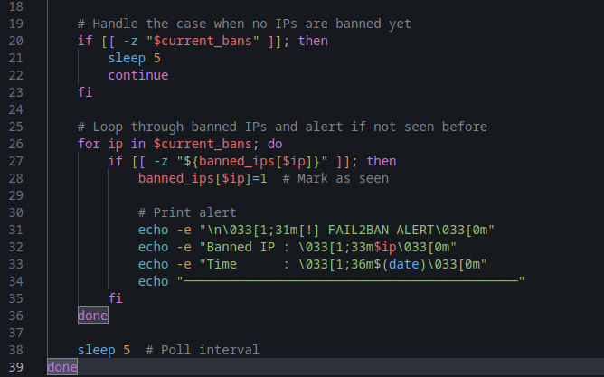

# Scripting: A beginners guide to Network Monitoring

### Welcome to the first writeup I have created. We'll start off with some basic scripting. In my writeups, you'll always find a "Track of the session", this will be a track that played during my writeup, that I feel was the best in the queue or best suited the session. If you like music, I guess that's a plus. 


### Track of the session: [Unorthodox (Radio Edit) - Wretch 32, Example](https://www.youtube.com/watch?v=LysZJBo2HI4) - This one is a great one, positive and creative vibe to dive right into the first writeup. Real ones know this track from Fifa Street 2012 back in the day. Now lets jump into it...


Okay, lets start off with purposes for these scripts that work together and create a situation, I'll use the reason I made them. Two scripts, one monitors outbound connections, and the other monitors a service called Fail2Ban for banned IPs. Fail2Ban is a log-based intrusion prevention tool, you will obviously need to have this installed before running this script. 


My reason for creating these was because I was looking at honeypot servers on ```shodan.io``` hosted on AWS, these servers had many services and web pages open and I decided to create these auxiliary scripts to investigate what these honeypots do if you decide to interact with them.


```Fail2Ban``` will detect anything within logs from services on your computer. For example, ```ssh```, ```RDP```, ```SMB,```, ```FTP``` and sometimes any aggressive port scanning back at your client IP, (TCP SYN/ACK scans, etc). Depending on the results a honeypot gets from a scan, and if the honeypot has been setup by some mad nutter, they can use those results to determine what OS and services your client is running and send crafted packets/requests targeting vulnerabilities, this especially can trigger constant errors in application logs, which will result in Fail2Ban detecting this and toss them into the sin bin (Fail2Ban jail) like its Paper Toss from back in the day... please bring that game back.


As for the outbound monitor script, it's extremely basic and written in bash (as my home machine runs Linux). It utilizes different commands to grab information on what connections are going outbound, what application/service is doing it and what port number. Lets get into the demonstration!


Here is the outbound script, very short as you can see, 34 lines all together, lets break it down into two snippets and explain the technicals behind it.


So we start of with the "pretty stuff", with the ```echo```, which prints the following text to let you know it is running. 


It then sets up temp files
```prev``` = ```/tmp/prev_conns```
```curr``` = ```/tmp/curr_conns```
This stores snapshots of your network connections.


We then make sure they are there with ```touch```, if not, ```touch``` will create them.


We then take an initial snapshot of connections using different commands/syntax to retrieve certain information.
```netstat -tunp``` lists all TCP/UDP connections with their process info. 


```grep ESTABLISHED``` filters by only current active connections, this is because ```grep``` only grabs ```ESTABLISHED```


```awk '{print $5. $7}'``` Grabs two columns, ```$5``` = remote address:port (what you're connected to) ```$7``` = Process ID/Program name (which process opened and is running the connection)


```sort``` orders them for easier comparison
Then finally redirects the output into ```"$prev"``` - this becomes the baseline list of established outbound connections.


Lets break down the second half, this is where we get our output. 


So, we start off with ```while true; do```, this keeps our infinite loop going in real time until we decide to hit ```Ctrl+C```.


We then capture the current connections - ```netstat -tunp 2>/dev/null | grep ESTABLISHED | awk '{print $5, $7}' | sort > "$curr"```
Same as the first snapshot but now we store this in ```$curr```, as this is current. 


```if [[ -s "$curr" && -s "$prev" ]]; then new_conns=$(comm -13 "$prev" "$curr")```
```-s``` checks that both files aren't empty.


```comm -13 "$prev" "$curr"``` compares the two sorted files and outputs only lines present in ```$curr``` but not in ```$prev```.


This means newly established connections since the last check, the result is stored in ```new_conns```


Printing new connections:
```if [[ -n "$new_conns" ]]; then echo -e "\n[+] New outbound connections detected:" echo "$new_conns" echo "Timestamp: $(date)" fi```
If there are new connections (```-n``` = not empty string), it prints them along with a timestamp.


Updating the baseline:

```mv "$curr" "$prev"```

Replaces the old snapshot with the most up to date one, so the next loop iteration only compares against the most recent state.


Hang about mate, I can't keep up. 

```sleep 5```

This pauses for 5 seconds before checking again, so the script isn't going nuts constantly.


That's the full script for the outbound monitor, provides good information on outbound connections. This is important if you're fooling around with honeypots because as stated earlier, some can start sending payloads out based on what your system is running, if successful, Fail2Ban could potentially fail to catch this. If that's the case, it's likely a reverse shell will be initiated and you'll be able to see that in the script output and pull the plug on the service effected. 


Lets jump into the Fail2Ban script!


Here is the full script, lets break it down into two pieces again. This is another short one, only 5 lines more than ```outboundmonitor.sh```.


So, lets start at the beginning. Here we are setting the jail to monitor, you can change these to ```sshd```, ```nginx-http-auth```, etc. That will monitor those services logs, here we are just monitoring portscans, I believe you can do multiple at once, though I have not tried yet as I don't run any other services nor any that are exposed on my home machine, I may spin up a lab in a future writeup demonstrating a live honeypot scenario.


Moving down to line 5 to 9, we just have a cool little banner to tell you its running, along with the ```Ctrl+C``` to stop.


Tracking banned IP's
```declare -A banned_ips``` - This declares an associative array (like a dictionary) to keep track of already reported IPs, so the script doesn't print duplicates.


Monitoring loops
```while true; do current_bans=$(sudo fail2ban-client status "$JAIL" 2>/dev/null | grep 'Banned IP list:' | awk -F': ' '{print $2}') ```
This creates an infinite loop, each cycle runs ```fail2ban-client status <jail>``` to get the current jail status.


```grep 'Banned IP list:'``` finds the line containing banned IPs.


```awk -F': ' '{print $2}'``` extracts the list of IPs and then finally stores them in ```current_bans```


Very simple explanation of the first half, lets head into the second half.sleep 5  # Poll interval





Handling our empty ban list:
```if [[ -z "$current_bans" ]]; then sleep 5 continue fi``` - If no IPs are banned as of now, this just waits 5 seconds then continues on with the loop
Please note that the code looks messy all together, this is how markdown files will contain it, you can see in the image that I have actually written it properly.


Looping through the banned IPs:
```for ip in $current_bans; do if [[ -z "${banned_ips[$ip]}" ]]; then banned_ips[$ip]=1  # Mark as seen``` - This goes through each IP that is currently in the ban list. If the IP is unknown and is a first time offender, and hasn't been seen before (```banned_ips[$ip]``` is empty), it will mark it down as seen, seen? Get it? Seeeeeeen rudeboy.... not funny? Alright, no need for jokes, this avoids printing duplicate alerts for the same IP.


Printing alerts for new bans:
```echo -e "\n\033[1;31m[!] FAIL2BAN ALERT\033[0m"```
```echo -e "Banned IP : \033[1;33m$ip\033[0m"```
```echo -e "Time      : \033[1;36m$(date)\033[0m"```
```echo "────────────────────────────────────────────"```
This prints a red coloured alert in the terminal when a brand new IP is banned, no slaps on the wrist for first time offenders around here... booked and jailed before you can send your next packet buddy. 

Anyways, here is what gets printed out.


- A red ```[!] FAIL2BAN ALERT```


- A yellow IP address


- Cyan timestamp


- Separator line for readability


These of course, can be changed to whatever colour you would like. Make it rainbow if you want, whatever tickles your fancy. 


The final line, very very overwhelming line... are you ready for it? Lets unveil it.


```sleep 5 # Poll interval```


This waits 5 seconds before our next check. Phew, took a while to explain that line.


That's it for the scripts! These paired together can make a great blue teaming duo for anyone doing independent research on honeypots, or even running malware samples within a lab! I have also used the outbound script to monitor what connections get made when a malware sample is run in a virtual environment, which you will see in future writeups de-compiling malware samples. 


Thank you for reading through, this was an enjoyable first writeup. To many more!
