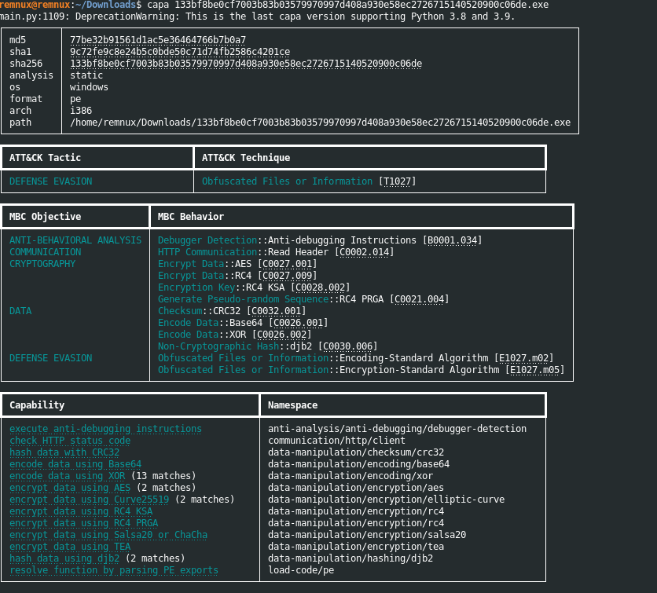
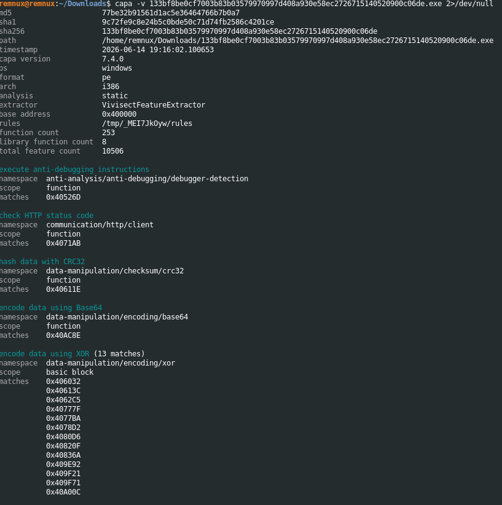
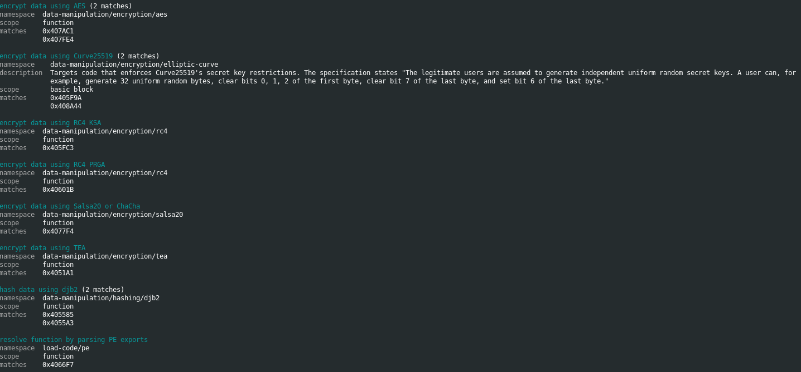
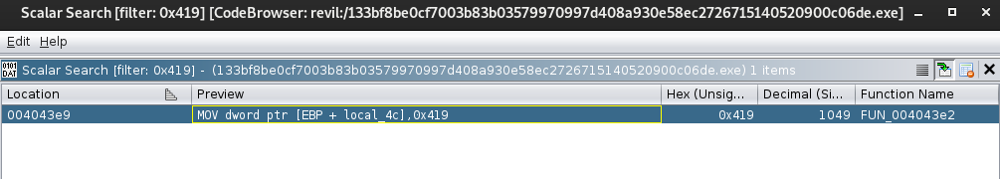
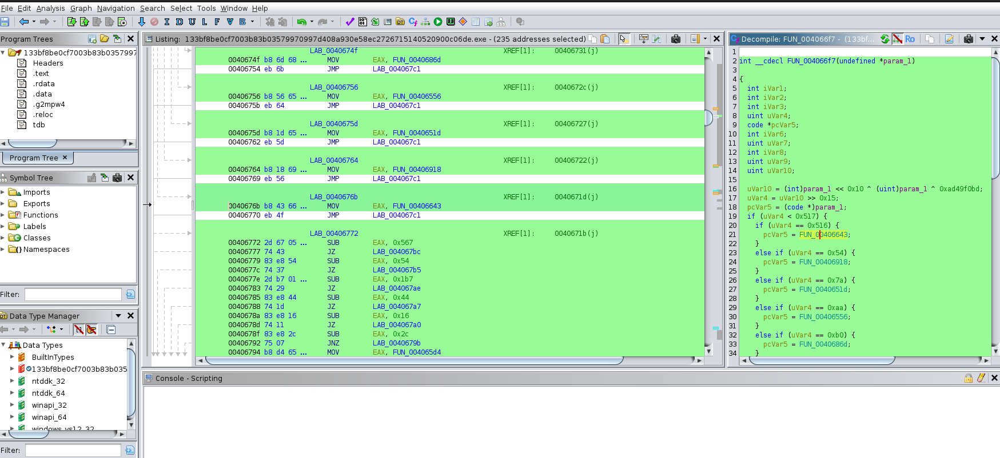
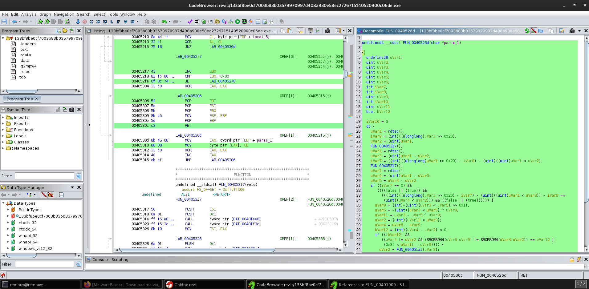
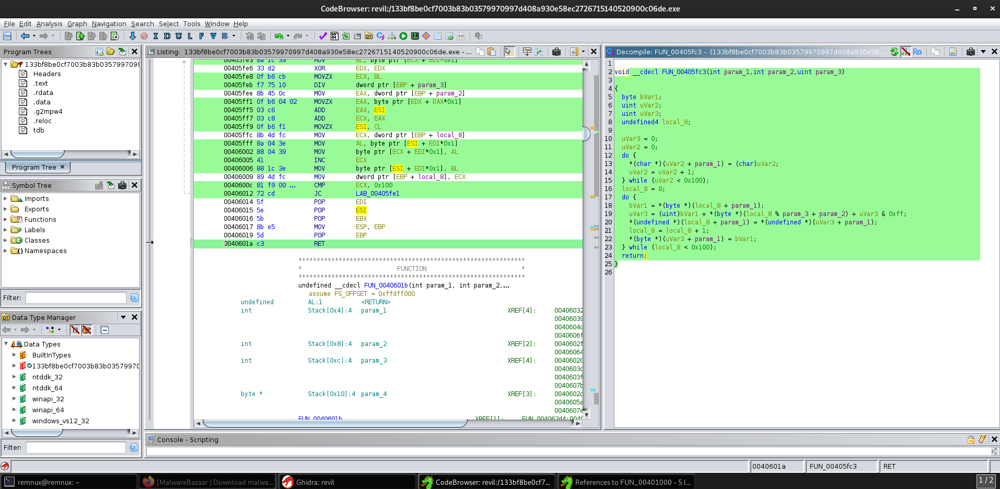
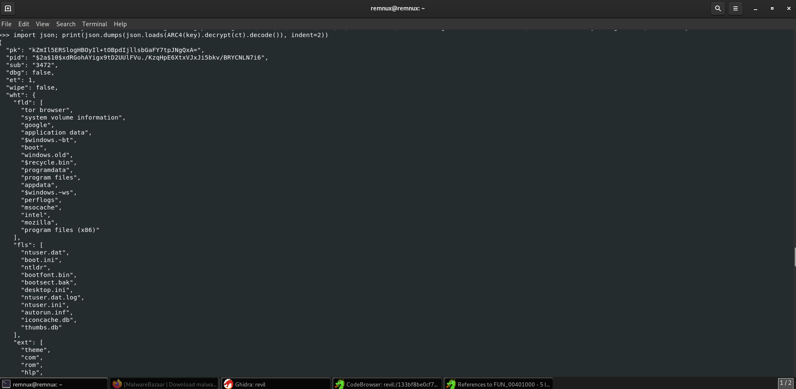
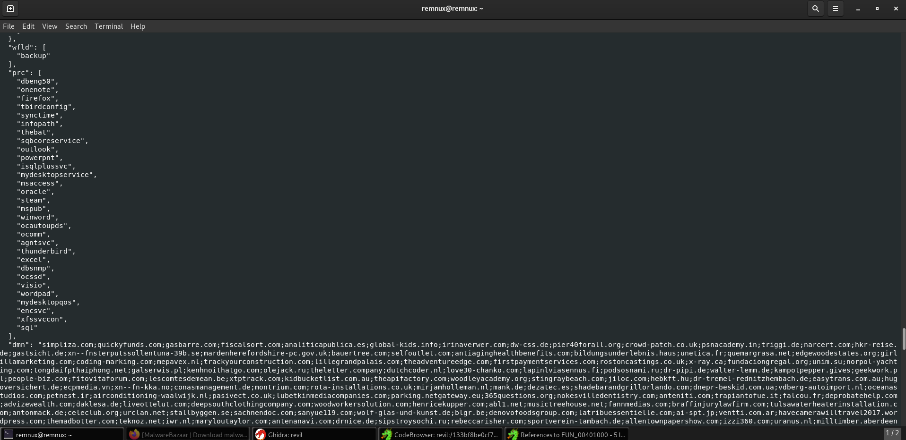

# Analysis: Recognizing flaws in Mother Russia’s ransomware variants - Patriotism for profit, killswitches and friendly fire


### In this writeup, I'll be sharing my knowledge on the modern day ransomware movement and the pioneers behind it. Grab a шашлык (basically a russian kebab from my knowledge, *pronounced Shashlik*), sit back and enjoy the writeup. 


### Track of the session: [BONES, Xavier Wulf, Chris Travis - WeDontBelieveYou](https://www.youtube.com/watch?v=D8AGKWyyrJ8)


# Chapter I - Background

For around a decade now, hacking has become more and more financially motivated each year. With 2017 being the catalyst and motivator for many groups I would say, following the WannaCry outbreak in May 2017.


No one really hacks for fun, knowledge or to sharpen their skills anymore, we don't have any more Gary McKinnons' (absolute mad lad btw). 


So, with ransomware being such a lucrative business model now, (yes, threat actors actually classify themselves as business operators, not criminals lol, i have seen this first hand, shoutout [Maksim Yakubets](https://www.fbi.gov/wanted/cyber/maksim-viktorovich-yakubets))


You might be asking, who is the MVP, the key player in the industry? No one in particular, but a certain region dominates the industry, which is by far Russia. 


However, I do side with the Russians, their name often tarnished for "hating the west" and constantly getting the blame for random cyberattacks that happen in and around the world day to day. Whilst yeah, to a degree some of it is true, the stereotype is quite narrowminded. A lot of big cyberatttacks especially in 2025, have been committed by english speaking geeks in their UK and USA bedrooms. 


This doesn't change their heavy presence in cybercrime today, as like I said they are one of the key players in Ransomware which I'll now get into. 


# Chapter II - Patriotism for profit

In most Commonwealth of Independent States (former soviet nations), they tend to produce a large number of technically strong young people. In these regions, legitimate pathways are often limited, and as opposed to western regions like the USA & UK, the underground economy is visible, accessible and normalized. This means most cybercrime communities are easy to come by and aren't hidden. Telegram is widely used in Russia, and is also used for communication and as general forums by threat actors.


As young actors explore this world, accompanied with the general Russian stance many grow up with on the west, they find that not only do Western organizations pay up the most, but law enforcement in those regions cannot directly arrest or extradite anyone based in Russia. Also, cross-border investigations are slow and politically restrained. 


In Russian-language cybercrime spaces, forums and channels, attacking foreign entities is often framed as:

- Less serious than domestic crime

- Victimless and abstract

- Comparable to exploiting "hostile" systems


This all originates from existing Russian stance on the west, and also probably the fact that they get blamed and tarnished for alot of stuff, so I guess it's a big fuck you to the west most of the time. Fair play lads. 


# Chapter III - Friendly fire, killswitches and the rozzers. 

Alright, it's all well and good unloading attacks left, right and centre like Stevie Wonder has just got his hands on a Kalashnikov... but how do you avoid the Gulag? It's a good question to ask, as these threat actors make absolute shed loads and authorities just turn a blind eye.


In most Russian ransomware if you reverse engineer it (I will cover some reverse engineering further down), a lot of functions will display things like checks for Russian locale Windows registry key entries, keyboard layouts etc. This is so they don't pull an American Normandy and drop bombs on their own troops. 


The malware will include a small killswitch function if it detects anything Russian or any where which is apart of the Commonwealth of Independent States (now excluding Ukraine). If and once this is detected, the malware will stop dead in it's tracks, tie the rope and kick the bucket and perish as if it was never there. 


How does this protect the actors? Well, it's a form of self-policing. As previously mentioned, enforcement is only put in place by the MVD and FSB (Russian alphabet agency rozzers) when their own are hit. So, this allows them to operate comfortably without the worry of getting nicked, provided the malware actually works, otherwise it's a long day and Uncle Vlad will be having a stern word.


# Chapter IV - The killswitch


Alright, let's get into it. I've pulled a REvil / Sodinokibi sample from MalwareBazaar, one of the most prolific ransomware-as-a-service operations to exist. Responsible for multiple ransoms against firms such as Kaseya, etc. 


Before we crack it open, let's run ```CAPA``` against it first. ```CAPA``` is a tool by Mandiant that analyses a binary and maps its capabilities before you even open a disassembler. THink of it as a capability fingerprint, it'll tell you what the binary can do and where, saving us from hunting blind in Ghidra. 











Straight away it's telling us everything we need. RC4 encryption, CRC32, Curve25519, Salsa20, anti-debugging instructions, and crucially: ```resolve function by parsing PE exports```. That last one is the API hashing we'll get into shortly. No explicit locale check flagged, I'll explain why in a moment. 


First thing REvil does before it even things about touching a single file is run a geographic check. Lets find it. 


### Finding the killswitch - hunting 0x419


Open the sample in Ghidra and let auto-analysis run. Once complete, ```Search -> Scalar Values``` and search for ```0x419```. One result comes back: 





That drops us straight into ```FUN_004043e2```. Here's what we're looking at:


```
local_4c[0]  = 0x419;   // Russian                                                                                                 
  local_4c[1]  = 0x422;   // Ukrainian                                                                                               
  local_4c[2]  = 0x423;   // Belarusian
  local_4c[3]  = 0x428;   // Tajik                                                                                                   
  local_4c[4]  = 0x42b;   // Armenian                       
  local_4c[5]  = 0x42c;   // Azerbaijani                                                                                             
  local_4c[6]  = 0x437;   // Georgian                       
  local_4c[7]  = 0x43f;   // Kazakh                                                                                                  
  local_4c[8]  = 0x440;   // Kyrgyz                                                                                                  
  local_4c[9]  = 0x442;   // Turkmen
  local_4c[10] = 0x443;   // Uzbek                                                                                                   
  local_4c[11] = 0x444;   // Tatar                          
  local_4c[12] = 0x818;   // Romanian (Moldova)                                                                                      
  local_4c[13] = 0x819;   // Russian (Moldova)                                                                                       
  local_4c[14] = 0x82c;   // Azerbaijani (Cyrillic)
  local_4c[15] = 0x843;   // Uzbek (Cyrillic)                                                                                        
  local_4c[16] = 0x45a;   // Syriac                                                                                                  
  local_4c[17] = 0x2801;  // Arabic (Syria)                                                                                          
                                                                                                                                     
  uVar1 = (*DAT_00410094)();   // GetSystemDefaultUILanguage                                                                         
  uVar2 = (*DAT_004100c8)();   // GetUserDefaultUILanguage                                                                           
                                                                                                                                     
  while ((local_4c[uVar3] != (uVar1 & 0xffff) && (local_4c[uVar3] != (uVar2 & 0xffff)))) {                                           
      uVar3 = uVar3 + 1;
      if (0x11 < uVar3) {                                                                                                            
          return 0;  // not whitelisted, continue execution                                                                          
      }                                                                                                                              
  }                                                                                                                                  
  return 1;  // whitelisted, bail out
```


18 hardcoded LANGIDs built on the stack. The two API calls - ```(*DAT_00410094)()``` and ```(*DAT_004100c8)()``` are ```GetSystemDefaultUILanguage``` and ```GetUserDefaultUILangauge```, resolved dynamically at startup via function pointers. That's why CAPA couldn't tag this as a locale check. No named imports anywhere, just raw pointers in a global table populated at runtime. 


Both return values get masked to 16 bits (```& 0xffff```) and compared against every entry. If either matches, whitelisted, malware exits. Exhaust all 18 without a match, execution continues and your files are getting encrypted. 


A couple of things worth noting oon this specific sample. Ukrainian (```0x422```) is in the list. This is a pre-2022 build. After the invasion, REvil builds quitely dropped Ukraine from the whitelist. Geopolitics written directly into the binary, brilliant. Also notice Arabic (Syria) at ```0x2801```. The only non-post-Soviet entry, almost certainly added at the request of a specific affiliate operating out of Syria. 


# Chapter V - Hiding from the rozzers (and the analysts)


Beyond the CIS check, REvil puts serious effort into making itself a nightmare to reverse engineer. Here's what I actually found pulling this sample apart. 


### No import table - API hashing


Open the imports in Ghidra. Empty. Nothing in the IAT whatsoever. Every single Windows API call is resolved at runtime using a custom hash. CAPA flagged this as ```resolve function by parsing PE exports``` at ```0x4066F7```:





The resolver takes a hash value, XORs it with ```0xad49f0bd```, then uses the upper bits to select which DLL to search via a switch-case. Each branch returns a module base address. The lower 21 bits identify the specific function within that DLL:


```
uVar10 = (int)param_1 << 0x10 ^ (uint)param_1 ^ 0xad49f0bd;
  uVar4 = uVar10 >> 0x15;  // upper bits = DLL selector
```

Then it walks the PE export table. ```0x3c``` to get ```e_lfanew```, ```+0x78``` for the export directory RVA, iterates through ```AddressOfNames```, hashes each with djb2, then compares the lower 21 bits:


```
iVar8 = *(int *)(*(int *)(iVar6 + 0x3c) + 0x78 + iVar6) + iVar6;
                                                                                                                                     
  if ((uVar7 & 0x1fffff) == (uVar10 & 0x1fffff)) {
      return function_pointer;                                                                                                       
  }
```


No import table means AV engines keying off API names find absolutely nothing. The locale check APIs are resolved this way too, hence why CAPA couldn't detect the killswitch statically.


### Anti-debugging - RDTSC timing loop


CAPA flagged anti-debugging at ```0x40526D```





```RDTSC``` is called three times, not two. It takes multiple timing deltas and cross-compares them for consistency. If you're stepping through in a debugger the deltas blow out and it clocks you. When it detects a timing anomaly it doesn't just exit, it feeds the delta values into the TEA encryption function (```FUN_00405lal```) and compares outputs. If they don't match, it bails.


It also runs this check 128 times, (```0x80``` iterations). Not a one shot, repeated statistical sampling across the entire pre-execution phase. Patch the jump condition in x64dbg to get past it.


### RC4 - config decryption and string obfuscation


CAPA confirmed RC4 KSA at ```0x405FC3```:





Textbook KSA - first loop initializes the 256-byte S-box with ```S[i] = i```, second loop does the key mixing with the classic ```j = (j + S[i] + key[i % keylen]) % 256``` swap pattern. RC4 is used for both config decryption and per-string obfuscation. Every string in the binary is encrypted with its own individual key stored alongside it in ```.data```. No single key to extract, no bulk decryption shortcut. 


### The config - RC4 encrypted JSON in a custom PE section


All of REvil's operational parameters live in an encrypted blob in a custom PE section. This sample uses ```.g2mpw4``` - visible in Ghidra's program trees panel. Different builds use different names (```.grrr, .zeacl``` etc.) to break signature detection. 


Layout of the config blob:


```
Bytes 0x00–0x1F  (32 bytes):  RC4 key (plaintext)
Bytes 0x20–0x23  (4 bytes):   CRC32 of ciphertext
Bytes 0x24–0x27  (4 bytes):   Ciphertext length
Bytes 0x28+:                  RC4-encrypted JSON
```


Extract it with Python:


```
import pefile, struct
  from arc4 import ARC4

  pe     = pefile.PE("sample.exe")
  data   = pe.sections[3].get_data()
  key    = data[0:32]
  ct_len = struct.unpack('<I', data[36:40])[0] - 1
  ct     = data[40:40+ct_len]
  print(ARC4(key).decrypt(ct).decode())
```


Running that against the sample (used JSON to clear it up):








Key fields from this specific build:


- dbg: false — production build, language check fully active


- et: 1 — encrypts first 1MB of each file only, speed over completeness


- exp: false — CVE-2018-8453 privilege escalation disabled (can BSOD the machine)


- wipe: false — no directory wiping on this build


- sub: 3472 — affiliate campaign ID, identifies exactly which operator deployed this


- svc — kills backup, Sophos, VSS, SQL, Veeam before encrypting


- prc — kills Word, Excel, Outlook, SQL engines etc. to release file locks before encryption starts


- arn: true — persistence enabled


- dmn — hundreds of compromised legitimate websites used as C2. Florists,dentists, law firms — all hacked and injected with C2 code. Blends into normaltraffic, no purpose-built infrastructure to take down


- nbody — ransom note, base64 encoded UTF-16LE. Decoded to: "---=== Welcome. Again. ===---" — a nod to their return after the 2021 law enforcement takedown, I guess? 


That's REvil. Clean, well engineered and properly thought through. The geographic killswitch alone is a masterclass in operational security - 18 lines of code functioning as a diplomatic non aggression pact baked directly into the binary. Russian authorites will be very happy with that one. 


If you're this far, thanks for reading! Was a fun 2/3 hour session. 
